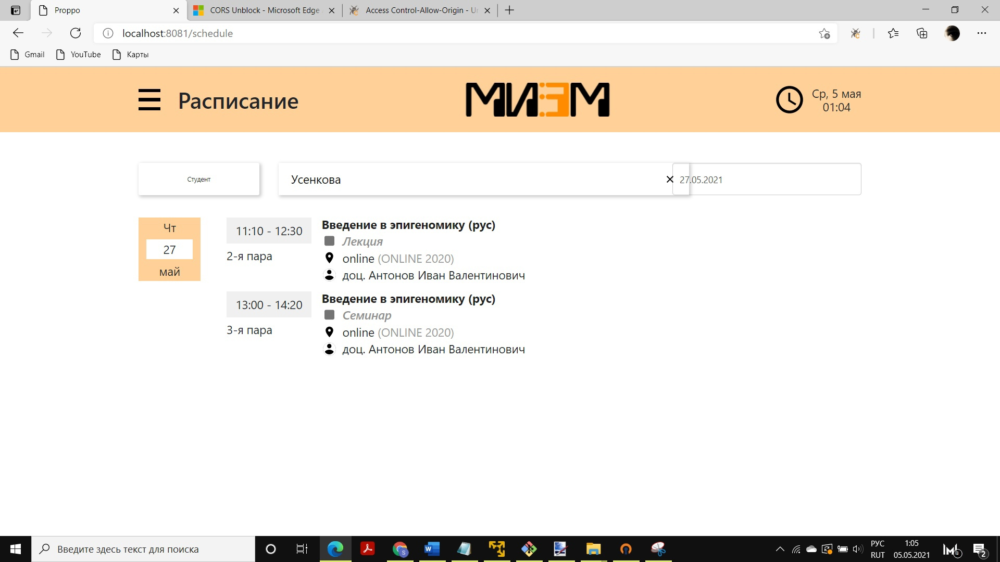
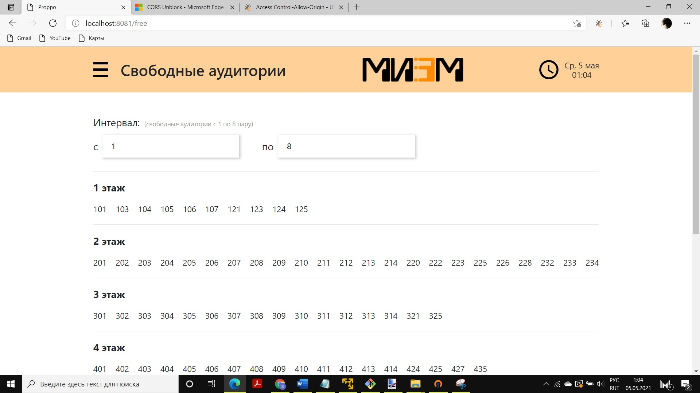
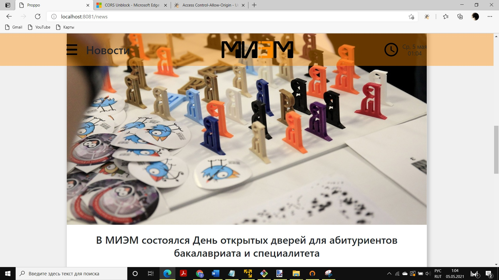
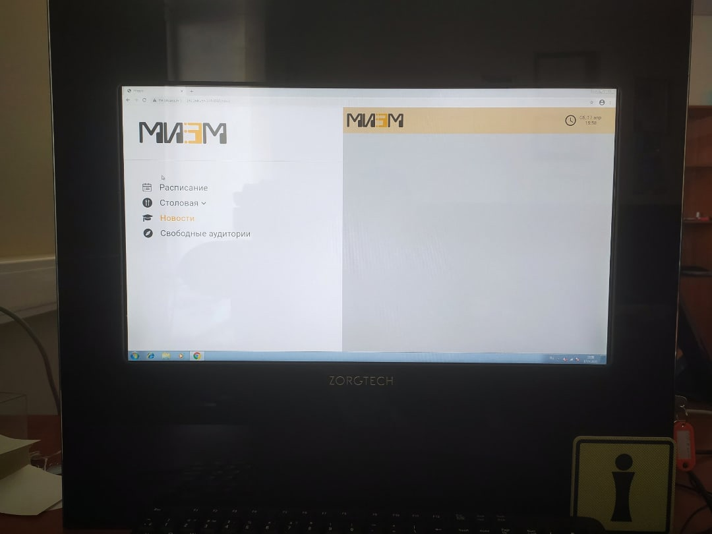
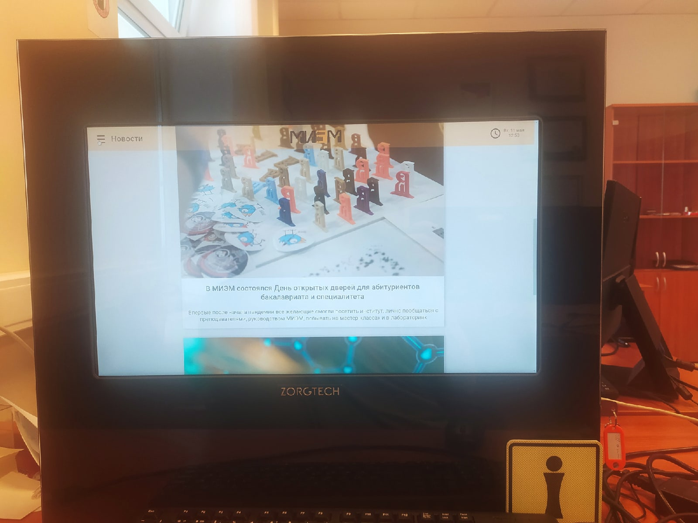

# Software package based on a touch monoblock

## Overview
Developed a software package for HSE University, integrated into a touch-screen monoblock system, providing essential functionalities for students and visitors.

## Technologies
PHP, Laravel, PhpMyAdmin

## Key Features
1) Displayed the latest university news and updates in real-time.
2) Provided personalized class schedules for students.
3) Showcased the daily menu for the university canteen.
4) Show available rooms in the university for a specific time interval
5) Integrated Google account authentication for secure student login and personalized access.

## Screenshots
### Timetable
This screenshot shows the class schedule interface from the software package, displaying personalized timetables for individual students, including details such as lecture/seminar times, location, and professor information.

<em>Screenshot of Student-Specific Timetable Generated by the Software Package</em>

### Available Rooms
This screenshot displays the functionality of the software package, showing available rooms in the university across different floors for a user-specified time period.

<em>Screenshot of Available Rooms in the University for a Specific Time Interval</em>

### News
This screenshot displays the latest news generated by my software package, showcasing updates and important announcements related to HSE University.

<em>Screenshot of Latest News in HSE University</em>

## Photos
### Homepage
This photo showcases the homepage of the software package as it appears on a touch monoblock, featuring key functionalities such as the timetable, canteen menu, news, and available rooms.

<em>Photo of the Application Homepage Displayed on a Touch Monoblock</em>

### News
This photo shows how the "News" section of the software package appears on a touch monoblock, featuring the latest updates and announcements from HSE University.

<em>Photo of the News Section Displayed on a Touch Monoblock</em>

